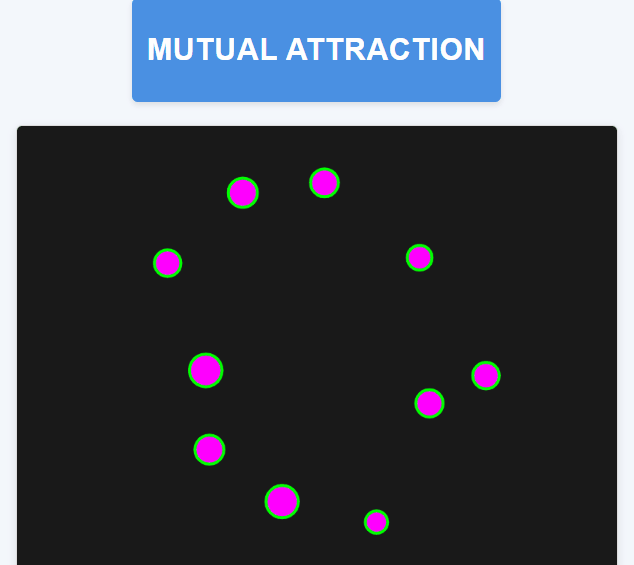

# Mutual Attraction 🌌

  

## Descrição do Projeto

Um projeto inspirado no canal do YouTube Coding Train, desenvolvido por Daniel Shiffman, que simula a atração gravitacional entre objetos usando p5.js.

### Características Principais

- Simulação de atração mútua entre corpos celestes
- Implementação de força gravitacional personalizada
- Uso de vetores para cálculo de movimento e atração
- Renderização dinâmica com p5.js

### Tecnologias Utilizadas

- JavaScript
- p5.js
- Programação orientada a objetos

## Como Executar

1. Clone o repositório
2. Abra o arquivo `index.html` em um navegador
3. Observe a simulação de atração mútua

## Licença

[MIT License](https://opensource.org/licenses/MIT)
